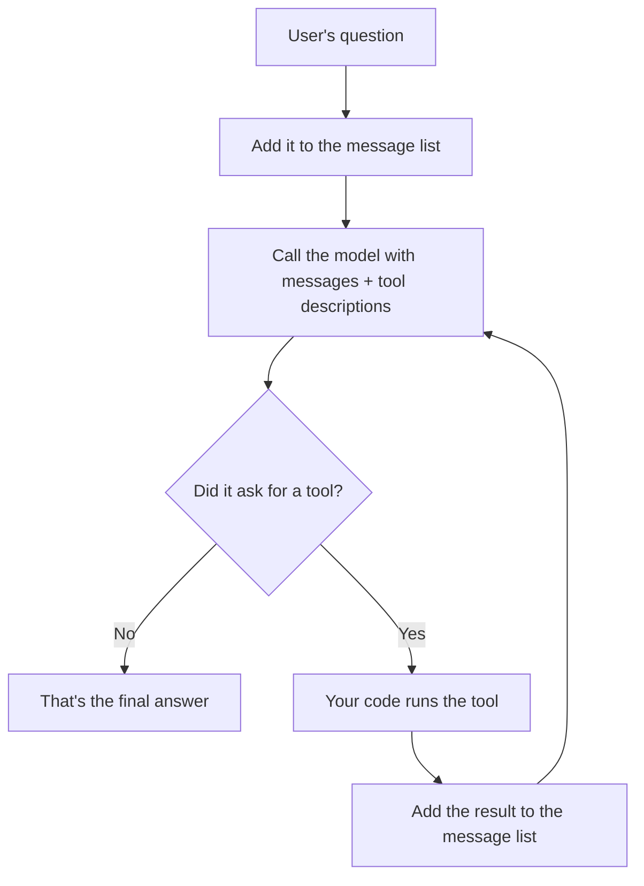

# Agent from Scratch

**Build an AI agent in plain Python. No LangChain, no LangGraph, no magic. Just a loop, an LLM API, and a few small files you can read in an evening.**

 

Most agent tutorials start with a framework. That gets you a demo fast, but you come away knowing the framework, not the agent. This repo does it the other way around: you build every piece yourself, see why it exists, and then the frameworks stop looking mysterious.

If you can read basic Python (functions, dicts, classes, `try/except`), you can follow this. You don't need any AI background.

---

## What you'll end up with

An agent that answers questions by picking and running tools on its own. Roughly what a run looks like:

```
You:    What's the weather in Chennai, and what's that temperature times 3?

Agent:  calls get_weather("Chennai")               ->  clear sky, 31.2°C
        calls mathematic_operations(31.2 x 3)      ->  93.6
        "It's 31.2°C in Chennai. Times 3, that's 93.6."
```

It has three tools:

| Tool | What it does | Where it runs |
|---|---|---|
| `mathematic_operations` | add, subtract, multiply, divide | your Python process |
| `get_weather` | live weather from OpenWeatherMap | your Python process |
| `run_python_code` | runs a short script the model writes | a locked-down Docker container |

And the part most tutorials skip, the **harness** that makes an agent trustworthy:

- **Retries** when the API hiccups
- **Safe tool execution**, so a broken tool becomes a message, not a crash
- **A step limit**, so it can't loop forever
- **Log files**, so you can read exactly what happened
- **Memory** across conversations, plus **summarizing** long ones
- **A Docker sandbox**, so model-written code can't touch your machine
- **An eval suite**, so you can measure whether a change helped or hurt

---

## The idea in five minutes

Read this once. Everything else in the repo is this idea, built out.

**A language model only produces text.** It can't run code, call an API, or open a file. So how does an agent "use tools"?

1. You **describe** your tools to the model (name, what it does, what inputs it takes).
2. The model **asks** for one, in a structured message like "please call `get_weather` with `city = Chennai`". That's just text. Nothing has run yet.
3. **Your code** runs the real function.
4. You **send the result back** to the model.
5. The model either asks for another tool or gives its final answer.

That cycle is the agent loop:



Two things to hold onto:

- **The model never runs anything. It can only ask.** Your code decides what actually runs. That's why there's a safe `execute()` function, and a sandbox for code the model writes.
- **The agent is the loop. The harness is everything around it** that keeps it reliable: retries, limits, logs, memory, sandbox, evals. Both are in this repo.

---

## Where everything lives

Click any file to open it.

| Path | What it's for |
|---|---|
| [`agent/llm.py`](agent/llm.py) | Talks to the Groq API. The only file that knows Groq exists. |
| [`agent/tools.py`](agent/tools.py) | Turns Python functions into tools, runs them safely, and holds the three tools. |
| [`agent/loop.py`](agent/loop.py) | The agent loop itself. |
| [`agent/context.py`](agent/context.py) | Saves and loads conversations, and summarizes long ones. |
| [`harness/tracing.py`](harness/tracing.py) | Writes a readable log file for each run. |
| [`harness/sandbox.py`](harness/sandbox.py) | Runs code inside a disposable Docker container. |
| [`smoke_test.py`](smoke_test.py) | A quick "does it all work together?" script. |
| [`evals/tasks.json`](evals/tasks.json) | The test questions and expected answers. |
| [`evals/run_evals.py`](evals/run_evals.py) | Runs every test, grades it, prints a score. |

Each file has one job. The files only share simple data (dicts and small dataclasses), so you can swap the model provider, add a tool, or change the sandbox without rewriting everything else.

---

## Run it in 5 minutes

**You'll need**

- Python 3.10 or newer
- A free [Groq API key](https://console.groq.com)
- A free [OpenWeatherMap API key](https://openweathermap.org/api) (new keys can take a little while to activate)
- [Docker](https://www.docker.com/products/docker-desktop/), only for the code-running tool

**1. Get the code**

```bash
git clone https://github.com/sxnjai23/Agent_from_Scratch.git
cd Agent_from_Scratch
```

**2. Make a virtual environment and install the packages**

```bash
python -m venv .venv

# Windows (PowerShell)
.venv\Scripts\Activate.ps1
# macOS / Linux
source .venv/bin/activate

pip install groq requests docker python-dotenv
```

**3. Add your keys**

Set them as environment variables in your terminal.

```bash
# Windows (PowerShell)
$env:GROQ_API_KEY = "your-groq-key"
$env:WEATHER_API_KEY = "your-openweather-key"

# macOS / Linux
export GROQ_API_KEY="your-groq-key"
export WEATHER_API_KEY="your-openweather-key"
```

Never paste keys into the code, and never commit them. If a key ever leaks (a commit, a screenshot, a chat), revoke it in the provider's console and make a new one.

**4. Check Docker works** (only needed for the code tool)

```bash
docker run --rm python:3.11-slim python -c "print(1+1)"
```

If that prints `2`, you're set.

**5. Talk to your agent**

```bash
python -m agent.loop
```

Type a question, or `exit` to quit. Try these:

- `What is 15 times 7?`
- `What's the weather in Chennai?`
- `Use code to find the 20th Fibonacci number`
- `Now divide that by 3` (right after one of the above, to test memory)

> **Always run commands from the repo's top folder, and use `python -m ...`.** Running a file by its path (like `python evals/run_evals.py`) breaks the imports and gives `No module named 'agent'`.

---

## Learn it step by step

Seven parts, about 10 to 20 minutes each. For each one: open the file, read it next to the explanation, run the "Try it" step, then move on. You can also rebuild the files yourself from scratch and compare with the repo version. That's the fastest way to really learn it.

### Part 1: Talking to the model
**File:** [`agent/llm.py`](agent/llm.py)

The Groq library returns deeply nested objects, and you'd rather not dig through those in every file. So this file is a translator. It's the only place that imports `groq`. Everything it sends back is a small, plain object: the text the model said, a list of tool requests (each with an id, a name, and arguments), and the token counts.

Two more things it does:

- **Retries.** API calls fail sometimes (rate limits, network blips). It waits a bit and tries again, a few times, before giving up.
- **Parses arguments.** The model sends tool arguments as a JSON string. This file turns them into a real dict once, so nobody else has to.

**Try it:** run `python -m agent.loop` and ask a plain question with no tool needed, like `What is the capital of France?`.

**Good to know:** the tool descriptions must be sent as a *list*. Passing a single dict gives a `400` error saying `'tools' : value must be an array`. Everyone hits this once.

### Part 2: Giving it tools
**File:** [`agent/tools.py`](agent/tools.py)

The model can't see your Python functions. It only sees a description: name, purpose, inputs. Writing that description by hand for every tool gets old fast, so this file builds it automatically from the function itself.

The trick is a **decorator**, the `@tool` line above each function. A decorator is a function that takes a function, does something with it, and hands it back. Here's what `@tool` does:

1. Reads the function's name, its docstring, and its parameters (with their type hints).
2. Builds the description the model needs.
3. Files the function in a dictionary called the registry.

Then it returns your function unchanged, so it's still a normal function you can test directly.

Things worth noticing in the file:

- **The docstring is what the model reads to decide when to use the tool.** Write it for the model. A vague docstring means wrong tool choices.
- **Type hints matter.** They're the only source of type information for the schema.
- **`execute()` is the gatekeeper.** Every tool call goes through it. It checks the tool exists, runs it, and turns *anything* that goes wrong into an error message the model can read and react to. It never crashes the loop.
- **Why a registry instead of running whatever name the model gives?** A registry is an allowlist. Only functions you marked with `@tool` can ever run. Looking names up in `globals()` would let the model call any function in scope.

**Try it:** ask for weather in a city that doesn't exist (`asdkjasdkj`). You should get a sensible reply, not a traceback. Then ask what 100 divided by 0 is.

**Exercise:** add your own tool. Write a function with type hints and a one-line docstring, put `@tool` on top, and ask the agent something that needs it. A "what time is it?" tool takes two minutes.

### Part 3: The agent loop
**File:** [`agent/loop.py`](agent/loop.py)

This is the whole agent, and it's short. The conversation lives in a list called `messages`, a growing transcript with four kinds of entries:

| Role | Who wrote it |
|---|---|
| `system` | your instructions to the model |
| `user` | the person's question |
| `assistant` | the model's reply, possibly including tool requests |
| `tool` | the result of a tool you ran |

Each round: ask the model, save its reply, and if it asked for tools, run them and save the results. Repeat until it answers without asking for anything.

Details that trip people up:

- **A tool call needs two messages.** First the assistant's request, then your tool result. Skip the first one and the next API call fails, because there's an answer with no question.
- **`tc.id` is a receipt number, not a memory address.** It's a string the API generates for each request, so results can be matched to requests when the model asks for several tools at once.
- **The tools are sent on every call.** The model doesn't remember them between requests. Look for `tools=schemas` in the loop.
- **`max_steps` is your safety net.** Without it, a confused model could loop forever and run up a bill.
- **Don't put `"tool_calls": null` in a message.** If there are no tool calls, leave the key out entirely. The API rejects `null`.
- **It returns a small dict** (answer, steps used, tokens used, status), not just a string, so the eval suite can measure runs.

**Follow one question all the way through.** Ask: *"What's the weather in Chennai, and what's that temperature times 3?"*

1. Your question goes into `messages`.
2. The model gets `messages` plus the tool descriptions. It replies with a request: `get_weather("Chennai")`.
3. Your code runs it and adds the result to `messages`.
4. The model sees the weather and asks for `mathematic_operations` with `31.2 x 3`.
5. Your code runs that, adds the result.
6. The model has what it needs and replies with plain text. No tool request, so the loop ends.

**Try it:** ask that exact question, then open the `.log` file for the run (see Part 4) and match each line to the steps above.

**Exercise:** temporarily print `messages` before every model call. Watching that list grow is the fastest way to understand agents.

### Part 4: Seeing what happened
**File:** [`harness/tracing.py`](harness/tracing.py)

Terminal output vanishes when you close the window. A log file doesn't. This one is deliberately simple: one timestamped line per event, like "used this tool with these arguments, got this back". It writes each line to disk immediately, so if a run crashes halfway, everything up to the crash is still there.

When something goes wrong, this is where you look first.

**Try it:** run a question, open its `.log` file, and check you can explain every line.

### Part 5: Memory
**File:** [`agent/context.py`](agent/context.py)

Out of the box, `messages` disappears when the function returns. Two ideas fix that.

**Saving and loading.** The conversation is written to a file named after a `session_id` (in `sessions/`). Same id next time means the agent picks up where you left off. A different id is a stranger. It saves after every step, so a crash doesn't lose progress.

**Summarizing.** Every request sends the *whole* transcript, so cost and size grow with every turn. When a conversation gets long, the old middle part is replaced with a short summary written by the model, while the most recent messages stay word for word.

One thing to be careful about when trimming: a tool result must always stay next to the assistant message that asked for it. Split them apart and the API rejects the request.

**Try it:** ask `What is 15 times 7?`, then `Now divide that by 3`. The agent should answer 35 because it can see the first exchange. Open the file in `sessions/` and read it.

**Good to know:** if you change how messages are saved and start getting strange `400` errors, delete the old files in `sessions/`. They may still hold the old, broken format.

### Part 6: Running code safely
**File:** [`harness/sandbox.py`](harness/sandbox.py)

`run_python_code` is different from the other tools. For `get_weather`, you wrote every line that runs. Here the model decides what code runs, and you can't predict it. It could delete files, read your keys, hit the network, or loop forever. Running that on your own machine is a real risk.

So it runs in a **disposable Docker container**:

- **The image** (`python:3.11-slim`) is a ready-made snapshot of a tiny Linux system with Python. Docker makes a fresh copy for every run.
- **Only the model's code runs inside.** None of your project exists in there: no `tools.py`, no keys, no `requests`. It's bare Python.
- **No network, and a memory cap.** The Linux kernel enforces these. It isn't trusting the code to behave.
- **The timeout is enforced from outside.** The container has no idea about your time limit. Your code waits, and if time runs out, it kills the container itself.
- **Output comes back as raw bytes.** Data crossing between your program and something else (a container, a socket, a file) travels as bytes, and you decode it into text. That's why you'll see `.decode("utf-8")` and a `.strip()` for the trailing newline that `print()` adds.
- **Cleanup always runs**, whether the code succeeded, crashed, or timed out.

**Try it:**

1. Ask: `Use code to find the 20th Fibonacci number`. You should get 6765.
2. Ask: `Use code to run an infinite loop: while True: pass`. It should be stopped after a few seconds.
3. Run `docker ps -a`. Nothing from your tests should be left behind. That's the real proof cleanup works.

**What this is and isn't:** it's a one-shot calculator. Every call starts fresh and is thrown away, so nothing persists between calls. A "coding assistant" that builds and tests projects would need a persistent workspace, file tools, and tighter controls. See [What to build next](#what-to-build-next).

### Part 7: Testing it properly
**Files:** [`smoke_test.py`](smoke_test.py), [`evals/tasks.json`](evals/tasks.json), [`evals/run_evals.py`](evals/run_evals.py)

Now stop eyeballing answers and measure them.

**Start with the smoke test.** It runs three questions, one per tool, and prints the answers.

```bash
python -m smoke_test
```

**Then break things on purpose.** The most useful tests are the ones built to fail. For each safety feature, trigger the failure it was made for:

| Break it by | You should see |
|---|---|
| asking `What is 100 divided by 0?` | an explanation, not a crash |
| asking for weather in `asdkjasdkj` | an error message, not a traceback |
| `Use code to run 1/0` | the sandbox reporting the crash |
| `Use code to run: while True: pass` | a timeout, and nothing left in `docker ps -a` |
| a task that needs 3 steps with `max_steps=1` | "Stopped: max steps reached" |
| a follow-up using "that" in the same session | the earlier result being used |
| turning off Wi-Fi and asking for weather | an error message, not a crash |

Every crash you find here is a missing piece of the harness.

**Then run the eval suite.** An eval is three things repeated: a task, the answer you expect, and a check that compares them.

```bash
python -m evals.run_evals
```

Roughly what you'll see:

```
PASS  math-1     steps=2  tokens=640   status=done
PASS  code-1     steps=2  tokens=910   status=done
FAIL  fail-1     steps=2  tokens=700   status=done

Score: 8/9 passed, 6420 tokens total
```

Design choices in the runner:

- **Every task gets a fresh session.** Otherwise tasks would remember each other and skew the results.
- **One crashing task doesn't stop the run.** It's recorded as a failure and the rest continue.
- **The grader is simple on purpose:** does the expected text appear in the answer? It will sometimes be too strict. When a task fails, open its log before blaming the agent. It's always one of three things: the grader was too strict, the agent chose badly, or you found a real bug.
- **It pauses between tasks** to stay under free-tier rate limits.

---

## Experiments to try

This is why the eval suite exists. **Change exactly one thing per run**, re-run the same tasks, and write down the score.

| Experiment | What to change | What you'll learn |
|---|---|---|
| Different models | the model name in the runner | which model picks tools most reliably, and what it costs in tokens |
| Vague tool description | rewrite one docstring badly | how much descriptions drive tool choice |
| No sandbox | remove `run_python_code` | how many tasks truly need it |
| System prompt | one line vs. a detailed prompt | how much instructions matter |
| No safety net | remove the `try/except` in `execute()` | how fast things break without it |

Keep your own results table:

| Run | Model | Change | Score | Avg steps | Total tokens |
|---|---|---|---|---|---|
| 1 | | baseline | | | |

---

## Stuck?

| What you see | Likely cause and fix |
|---|---|
| `No module named 'agent'` | You ran a file by path. From the repo's top folder, use `python -m ...`. |
| `KeyError: 'GROQ_API_KEY'` | The key isn't set in this terminal. Set it again (see the setup step). |
| `400 ... 'tools' : value must be an array` | Tools must be a list, even with one tool. |
| `400 ... tool_calls : Value is not nullable` | A message has `"tool_calls": null`. Leave the key out, then delete the old files in `sessions/`. |
| A `400` right after a tool ran | A tool result lost its matching assistant message. |
| Weather gives a 401 | New OpenWeatherMap keys take a while to activate. Also check the key. |
| `Could not start the sandbox` | Docker isn't running. Start Docker Desktop and re-check with the `docker run` command. |
| `429` / rate limit errors | Free tiers have limits. Add a longer pause in the eval runner, or use fewer tasks. |
| Leftover containers | Run `docker ps -a`, then `docker rm -f <id>`. |

---

## Staying safe

- **Keys live in environment variables (or a `.env` file that's in `.gitignore`), never in code.**
- **Never run model-written code on your own machine.** Sandbox it.
- **Use allowlists.** The registry only runs registered tools. Don't run model output through `eval()`, `exec()` or `globals()`.
- **Think before adding tools.** A file tool should be locked to one folder (and block `../` tricks). A shell tool can be steered by text the model reads, which is called prompt injection.
- **Retries can repeat side effects.** Retrying a read is harmless. Retrying something that writes, sends, or pays can do it twice.

---

## Words you'll meet

| Term | Meaning |
|---|---|
| **Agent** | a model in a loop that can choose and use tools to reach a goal |
| **Harness** | everything around the agent that keeps it reliable: retries, limits, logs, memory, sandbox, evals |
| **Tool calling** | the model asks for a named function with arguments; your code runs it |
| **Schema** | the description of a tool (name, purpose, inputs) that the model reads |
| **Decorator** | a function that takes a function and returns a function, like `@tool` |
| **Registry** | a dictionary of tool names to functions |
| **Session** | a saved conversation, identified by a `session_id` |
| **Token** | a chunk of text; model cost and limits are counted in tokens |
| **Context window** | the most text a model can take in one request |
| **Sandbox** | an isolated place to run code you don't trust |
| **Eval** | an automated test: tasks, expected answers, and a grader |

---

## What to build next

**Small upgrades**

- A **token budget** that stops a run when it gets too expensive
- Smarter retries: only on rate limits, server errors and connection drops, and honoring `retry-after`
- A description for each tool argument, not just the tool
- A **circuit breaker** that stops calling a tool that keeps failing
- Structured logs (JSON lines) and a small replay script
- More tools: web search, a folder-restricted file reader/writer

**Bigger projects**

- A **persistent sandbox workspace** so the agent can write files and iterate, which turns the calculator into a coding assistant
- **Port it to LangGraph or Google ADK** and compare. You'll see exactly what a framework adds and what it hides.
- Human approval before risky tools run
- Streaming and parallel tool calls

**Good code to read after you've built your own**

- [SWE-agent/mini-swe-agent](https://github.com/SWE-agent/mini-swe-agent): a tiny agent with a clean split between agent, model and environment
- [sergenes/mini_agent](https://github.com/sergenes/mini_agent): a framework-free agent with a reliability layer
- [pguso/agents-from-scratch](https://github.com/pguso/agents-from-scratch): a lesson-by-lesson build with evals and telemetry

---

## Contributing

Found a bug, a confusing explanation, or a step that didn't work on your machine? Please [open an issue](https://github.com/sxnjai23/Agent_from_Scratch/issues). Fixes to the tutorial are as welcome as fixes to the code. If this helped you, a star on the repo means a lot.

## License

[MIT](LICENSE). Use it, learn from it, build on it.
