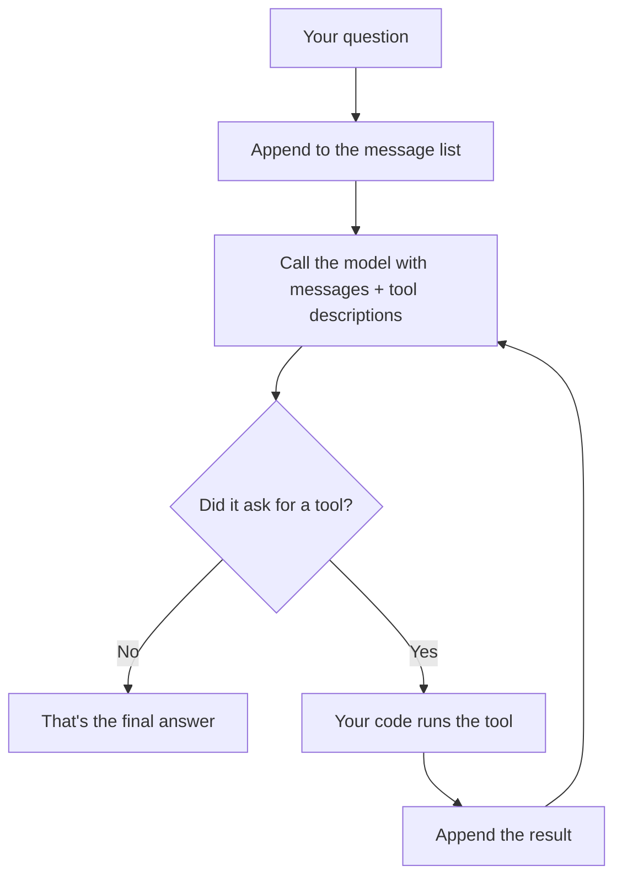

# Agent & Harness from Scratch

**Build the agent first. Build the harness second. Then the frameworks stop looking like magic.**

No LangChain. No LangGraph. No magic. A loop, an LLM API, and six small files you can read in an evening.

```python
You:    What's the weather in Chennai, and what's that temperature times 3?

Agent:  calls get_weather("Chennai")           ->  clear sky, 31.2°C
        calls mathematic_operations(31.2 x 3)  ->  93.6
        "It's 31.2°C in Chennai. Times 3, that's 93.6."
```

   

**Built by [Sanjii](https://github.com/sxnjai23)** · [LinkedIn](https://in.linkedin.com/in/sanjai-jayabal)

---

## Why this exists

Every agent tutorial starts with a framework. You get a demo fast, and you leave knowing the framework instead of the agent.

This repo does it backwards. You build every piece, you see why each one is needed, and then LangGraph and Google ADK look like thin wrappers around things you've already written.

> **Agent = model + harness.** The model brings the intelligence. The harness brings everything else.

| The model gives you | The harness gives you |
|---|---|
| language and reasoning | tools it can actually use |
| a guess at the next step | a loop that carries the steps out |
| answers from its prompt | context, memory, saved state |
| | limits, safety, retries, logs, tests |

Same model, opposite results, depending on what's around it. **That's harness engineering.**

---

## Setup

**You'll need:** Python 3.10+, a free [Groq key](https://console.groq.com), a free [OpenWeatherMap key](https://openweathermap.org/api) (new keys take a while to activate), and [Docker](https://www.docker.com/products/docker-desktop/) for the code tool.

```bash
git clone https://github.com/sxnjai23/Agent_from_Scratch.git
cd Agent_from_Scratch

python -m venv .venv
.venv\Scripts\Activate.ps1          # Windows
source .venv/bin/activate           # macOS / Linux

pip install groq requests docker python-dotenv
```

Put your keys in a `.env` file (already in `.gitignore`):

```
GROQ_API_KEY=your-groq-key
WEATHER_API_KEY=your-openweather-key
```

**Run it:**

```bash
python main.py                                       # interactive chat
python main.py "What is 15 times 7?"                 # one task and exit
python main.py --new "…"                             # fresh session
python main.py --session work --max-steps 5          # named session
```

```
You › What's the weather in Chennai?
────────────────────────────────────────
Agent › Chennai: clear sky, 31.2°C
[done · 2 steps · 640 tokens]
────────────────────────────────────────
```

Read that `status` line. It tells you how the run ended, which is the fastest way to know whether the model did the work or got stuck.

| Status | Meaning |
|---|---|
| `done` | the model gave a final answer |
| `budget` | the token ceiling was hit (checked *before* the next call) |
| `max_steps` | it ran out of turns |

> Run from the repo's top folder. `sessions/` is a relative path and `harness/` and `evals/` are top-level packages.

---

## How an agent works

A language model only produces **text**. It can't run anything. So how does it "use tools"?

1. You **describe** your tools — name, purpose, inputs.
2. The model **asks** for one: `call get_weather(city="Chennai")`. Still just text.
3. **Your code** runs the real function.
4. You **send the result back**.
5. It asks for another tool, or it gives a final answer.



> **The model never runs anything. It can only ask.** That's why there's a safe `execute()`, and a sandbox for code the model writes.

---

## The three tools

| Tool | What it does | Where it runs |
|---|---|---|
| `mathematic_operations` | ten arithmetic verbs on two numbers | your Python process |
| `get_weather` | live weather from OpenWeatherMap | your Python process |
| `run_python_code` | runs a short script the model writes | a locked-down Docker container |

You write none of the tool descriptions by hand. The `@tool` decorator reads the function's name, docstring and type hints, builds the schema, and files the function in a registry. **The docstring is what the model reads** — a vague one means wrong tool choices.

---

## The harness

The agent is the driver. The harness is the seatbelt, the dashboard, the speed limiter and the crash test lab. The driver never changes. What changes is whether you'd let it out on the road.

| Piece | What goes wrong without it | Where |
|---|---|---|
| Retries with backoff | one rate limit ends the run | `agent/llm.py` |
| Safe tool execution | one failing tool crashes everything | `agent/tools.py` |
| Tool allowlist | the model calls something you never exposed | `agent/tools.py` |
| Step limit | a confused model loops forever | `agent/loop.py` |
| Token budget | a long run quietly runs up a bill | `agent/loop.py` |
| Run stats | you can't tell what a run cost | `agent/loop.py` |
| Tracing | "it didn't work" with no way to find out why | `harness/tracing.py` |
| Session memory | the agent forgets between runs | `agent/context.py` |
| Summarization | long chats get slow, then impossible | `agent/context.py` |
| Docker sandbox | model-written code runs on your machine | `harness/sandbox.py` |
| Evals | you change something with no idea if it helped | `evals/` |

**The rules that keep it clean:**

- **The loop stays small.** Every harness concern is one function call at a known line.
- **One gatekeeper for tools.** All safety lives in `execute()`. Tools just raise; `execute()` catches.
- **The sandbox is an implementation detail of one tool.** The loop has no idea Docker exists, so you can swap it without touching the loop.
- **Nothing outside `llm.py` knows Groq exists.** Swap the provider by rewriting one file.
- **Failures become text.** Errors become messages the model can read and recover from. An exception reaching you is a bug; one reaching the model is data.

---

## The sandbox

When the model writes code, that code never touches your machine. It runs in a throwaway Docker container and the container is destroyed right after.

```
model → "run this code" → your code → fresh container (no network, 128 MB cap) → read output → delete
```

| Inside | Not inside |
|---|---|
| Python 3.11 + stdlib | your project files |
| the one script the model wrote | your API keys and env vars |
| a small memory allowance | the internet and your LAN |
| | `requests` and other packages |

| Guardrail | What it stops |
|---|---|
| Fresh container per call | leftovers bleeding between runs |
| No network | exfiltration, downloads |
| Memory cap | a script eating your RAM |
| Timeout, enforced from outside | infinite loops |
| Cleanup in `finally` | dead containers piling up |
| Errors become text | a bad script crashing your agent |

Try `Use code to find the 20th Fibonacci number`, then `Use code to run an infinite loop: while True: pass`, then `docker ps -a` to prove cleanup works.

**Honest limits:** it's a one-shot calculator — nothing persists between calls. Only memory and time are capped. Containers share the host kernel, which is fine for your own agent and not a wall against hostile code at scale.

---

## Testing it

**Eyeball it:**

```bash
python main.py "What is 15 times 7?"
python main.py "Use code to find the 20th Fibonacci number"
```

**Break it on purpose** — the most useful tests are the ones built to fail:

| Break it by | You should see |
|---|---|
| `What is 100 divided by 0?` | an explanation, not a crash |
| weather in `asdkjasdkj` | an error message, not a traceback |
| `Use code to run 1/0` | the sandbox reporting the crash |
| `while True: pass` | a timeout, nothing left in `docker ps -a` |
| Wi-Fi off + weather | an error, not a crash |

**Then measure it:**

```bash
python -m evals.run_evals
```

```
Running multi-2...
PASS  multi-2     steps=5  tokens=2651  status=done
Score: 1/1 passed, 2651 tokens total
```

An eval is a task, the expected answer, and a grader. Every task gets a **fresh session** (otherwise they remember each other), one crash doesn't stop the run, and it **pauses between tasks** to stay under free-tier limits. `evals/tasks.json` has ten more, including sandbox tests and two that must fail safely.

---

## Two things this doesn't do yet

Being upfront beats overselling.

**No loop detection.** The step limit and token budget are a *cliff*, not a *guard* — they stop the run but never notice the model is stuck. A real log from this repo:

```
mathematic_operations({'a': 1, 'b': 2, 'operation': 'add'}) -> 3
mathematic_operations({'a': 1, 'b': 2, 'operation': 'add'}) -> 3
...                                (eleven times, then a budget stop)
```

Nothing failed, so the model got no signal it was wrong and kept going. The fix is small and belongs in `execute()`: remember the last call, and if the same one repeats, return an error *text*. A breaker keyed on **failures** won't catch this — it has to key on **repetition**.

**The full transcript is resent every turn.** Nothing is trimmed between steps, so a ten-step run costs far more in re-reads than in work. Summarization only kicks in when a session *resumes*, never mid-run.

---

## Where everything lives

| Path | What it's for |
|---|---|
| `main.py` | CLI entry point — interactive chat, or one task and exit |
| `agent/llm.py` | the Groq API. The only file that knows Groq exists |
| `agent/tools.py` | the `@tool` decorator, the registry, and `execute()` |
| `agent/loop.py` | the agent loop |
| `agent/context.py` | session save/load and summarization |
| `harness/tracing.py` | the run log |
| `harness/sandbox.py` | the Docker sandbox |
| `evals/tasks.json` · `tasks2.json` | test questions and expected answers |
| `evals/run_evals.py` | runs, grades, prints a score |

Each file has one job. They share only simple data, so you can swap the provider, add a tool, or replace the sandbox without rewriting anything else.

Full line-by-line reference, defect catalogue and token-cost analysis: **[`../KNOWLEDGE.md`](../KNOWLEDGE.md)**

---

## Build it yourself

Seven parts, 10–20 minutes each. Open the file, read it beside the explanation, run the "try it" step. Rebuilding each file from scratch and comparing is the fastest way to actually learn it.

1. **Talking to the model** — `agent/llm.py`
2. **Giving it tools** — `agent/tools.py`
3. **The agent loop** — `agent/loop.py`
4. **Seeing what happened** — `harness/tracing.py`
5. **Memory** — `agent/context.py`
6. **Running code safely** — `harness/sandbox.py`
7. **Testing it properly** — `evals/`

---

## What to build next

**Small:** a repetition detector in `execute()` (highest value) · per-turn context trimming · wire up the `--max-tokens` and `--model` flags, which are parsed but currently ignored · smarter retries that honor `retry-after` · per-argument schema descriptions · a real circuit breaker

**Big:** a persistent sandbox workspace — the step from calculator to coding assistant · human approval before risky tools · streaming and parallel tool calls · porting it to LangGraph or Google ADK to see exactly what a framework adds and hides

**Read after building your own:** [mini-swe-agent](https://github.com/SWE-agent/mini-swe-agent) · [mini_agent](https://github.com/sergenes/mini_agent) · [agents-from-scratch](https://github.com/pguso/agents-from-scratch)

---

## Staying safe

- **Keys live in the environment, never in code.** If one leaks, revoke it in the provider's console.
- **Never run model-written code on your machine.** Sandbox it.
- **Use allowlists.** Don't run model output through `eval()`, `exec()` or `globals()`.
- **A file tool must be locked to one folder** and block `../` tricks. A shell tool can be steered by text the model reads — that's prompt injection.
- **Retries repeat side effects.** Retrying a read is harmless. Retrying a write does it twice.

---

## Stuck?

| What you see | Fix |
|---|---|
| `No module named 'agent'` | Run from the repo's top folder with `python main.py` |
| `KeyError: 'GROQ_API_KEY'` | Set the key in this terminal (raises at import) |
| `DockerException` at startup | Docker isn't running; the sandbox connects at import time |
| `'tools' : value must be an array` | Tools must be a list, even with one tool |
| `tool_calls : Value is not nullable` | Don't put `"tool_calls": null` in a message |
| Runs end in `budget`/`max_steps` | The model is stuck, not crashing — see above |
| `--max-tokens` does nothing | It doesn't yet. The ceiling is a constant in `run_agent` |
| Weather 401 | New OpenWeatherMap keys take time to activate |
| `429` rate limit | Free tier limits. Pause longer, or use fewer tasks |
| Leftover containers | `docker ps -a`, then `docker rm -f <id>` |

---

## Credits

**Built with:** Python, the [Groq](https://groq.com) API (`openai/gpt-oss-20b`), [OpenWeatherMap](https://openweathermap.org), [Docker](https://www.docker.com).

**Extended beyond the original tutorial** with a `main.py` CLI, a token budget enforced before each call, a `status` field distinguishing `done`/`budget`/`max_steps`, a ten-operation math tool, and a chained-arithmetic eval task.

**Inspired by:** [mini-swe-agent](https://github.com/SWE-agent/mini-swe-agent) · [mini_agent](https://github.com/sergenes/mini_agent) · [agents-from-scratch](https://github.com/pguso/agents-from-scratch) — all worth reading once you've built your own.

MIT. Use it, learn from it, build on it. · [Issues](https://github.com/sxnjai23/Agent_from_Scratch/issues) · [Full tutorial](README.md)
